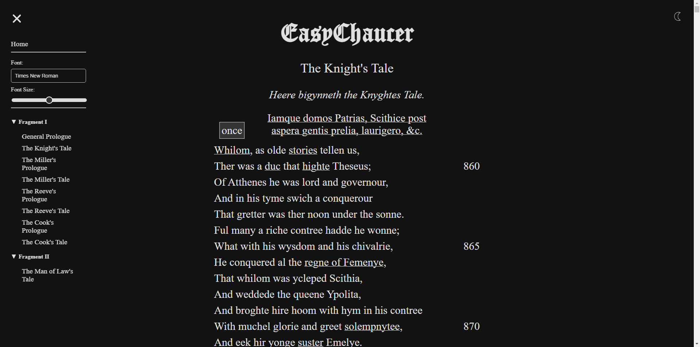

# Easy Chaucer

Easy Chaucer is a web reader with on-screen notes for Geoffrey Chaucer's 'The Canterbury Tales'. It provides different options for font size and family, and includes light, dark, and sepia themes.

## Authors

* **João Bordalo** - *Initial work* - [jbordalo](https://github.com/jbordalo)
* **Jacinta Sousa** - *Initial work* - [00jcnt](https://github.com/00jcnt)